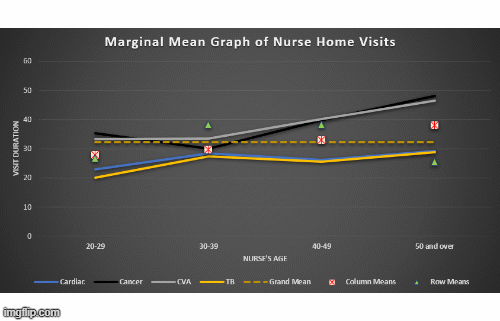

## **``Statistical Testing``** :: ``Using Pen, Paper, Python and Excel``
##### **This repository is created for storing the components of Statistical Tests carried out on One, Two and Three or more populations using Python. Here, I have also worked on some of the real-life datasets to perform Statistical or Hypothesis Testing.**

##### **Also, shared the `hand-written notes` & `python implementations` which I created to attain better knowledge around these tests.**

**Below are the tasks carried out in this project:**

1. #### **``Python implementation of statistical tests``**

2. #### **Solved ``One Population`` problems**
	1. T Test or STUDENT-T or STUDENT Test
	2. Z Test
	3. Population Proportion
	4. Chi-Square Test

3. #### **Solved ``Two Populations`` problems**
	1. Large Independent Samples
		1. Pooled Large Independent Samples
		2. Not-Pooled Large Independent Samples
	2. Small Independent Samples
		1. Pooled Small Independent Samples
		2. Not Pooled Small Independent Samples
	3. Population Proportions
		1. Large Independent Proportions -- Z Test
	4. Dependent Samples
		1. Small Dependent Samples -- T Test
	5. F-Distribution (2 variances or standard deviations)

4. #### **``ANOVA``**
	1. **Solved ``One-factor`` problems**
		1. Post-Hoc Analysis
		2. Normality Test
		3. Homogenity Test
    	
	2. **Solved ``Two-factors W/O Repetition`` problems**
		1. Running 1-Way ANOVA
		2. Running 2-Way ANOVA
		3. Post-Hoc Analysis
		4. Normality Test
		5. Homogenity Test
	
	3. **Solved ``Two-factors With Repetition`` problems**
		1. Running 1-Way ANOVA
			1. 1-Way ANOVA Post-Hoc
		2. Running 2-Way ANOVA
			1. Post-Hoc Analysis
			2. Normality Test
			3. Homogenity Test

5. #### **``Bootstrapping`` and its usecases**

6. #### **How to use ``Multi-variate ANOVA, ANCOVA & MANCOVA`` & interpret their results?**

7. #### **Let's use ``Excel`` for ``ANOVA``**

8. #### **Understand various ``Distribution Functions`` graphically**

---

:diving_mask: **``Fun-Fact``** :: ***Why I wrote some of these statistical tests from scratch?*** :man_shrugging:
- It was not only my eagerness to gain a full understanding but python statistical packages (like statsmodels and others) were following slightly different mathematical formulations for these tests. 
- So, I was getting a noticeable difference while comparing my on-paper calculated p-values with python-generated p-values. That motivated me to look into the `statsmodels` implementations and find such differences. :innocent:

---

:orange_book: **``Textbook referred``** :: [Biostatistics: A Foundation for Analysis in the Health Sciences, 10th Edition](https://www.wiley.com/en-us/Biostatistics%3A+A+Foundation+for+Analysis+in+the+Health+Sciences%2C+10th+Edition-p-9781119625506)

:white_check_mark: **``Datasets used in Textbook``** :: [Download](https://bcs.wiley.com/he-bcs/Books?action=chapter&bcsId=2191&itemId=0471456543&chapterId=15330) :point_left:
